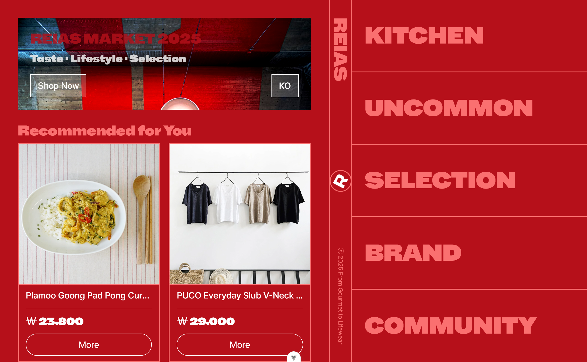
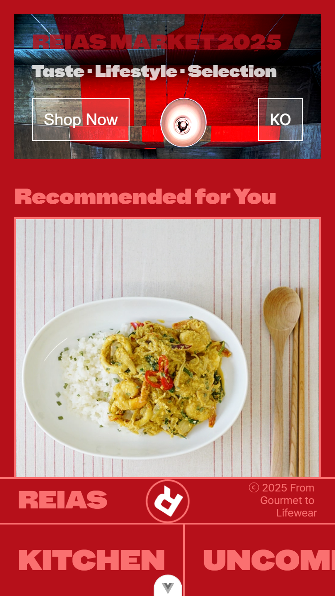
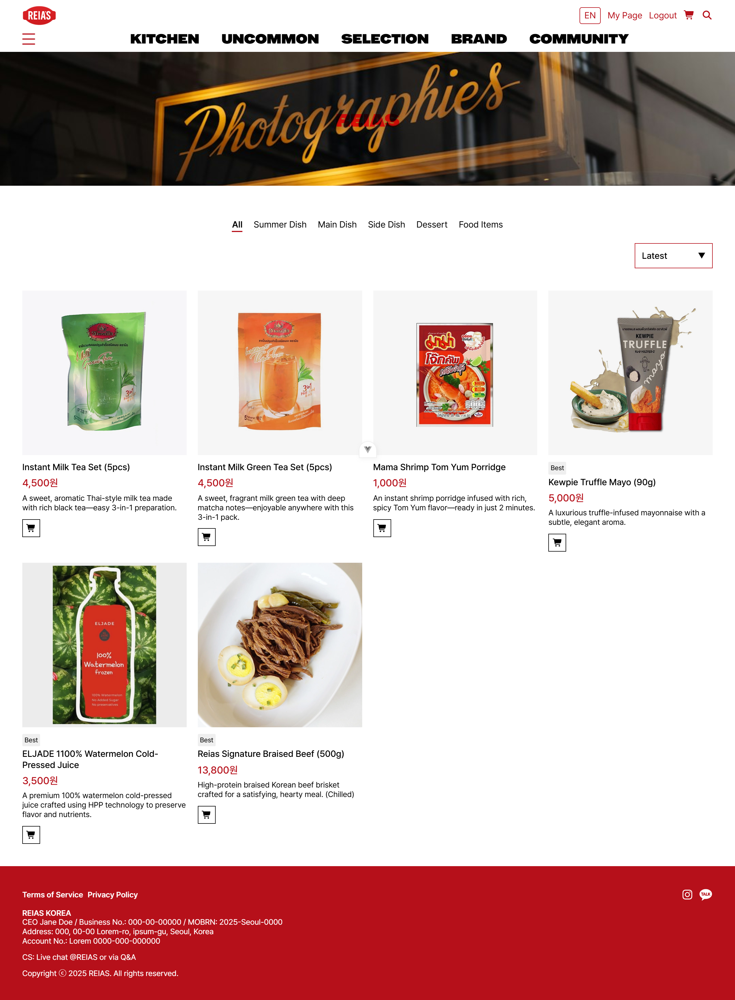
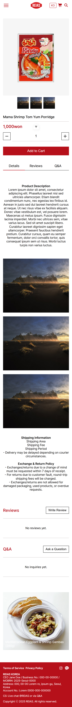

# 🛒 REIAS — Vue.js Shopping Mall Project

_A Modern Multi-Category E-Commerce Frontend built with Vue 3 + Vite_



<h1 align="center">🛒 REIAS — Vue.js Shopping Mall</h1>
<p align="center">
  A refined, fully responsive Vue 3 shopping mall featuring category navigation, product options, cart system, order flow, and multilingual UI.
</p>

<p align="center">
  
  
  
  
  
  
</p>

---

# ⭐ Overview (EN)

**REIAS** is a modern, high-fidelity shopping mall frontend built with **Vue 3 + Vite**, designed as a portfolio-grade e-commerce interface.

It provides:

- Multi-category product browsing
- Brand filters & custom submenus
- Product detail pages with option selection
- Add-to-cart system with quantity controls
- Full order sheet & form validation
- Multi-language UI (KR/EN) with Vue I18n
- Responsive layouts for PC, tablet, mobile
- Dynamic banners using Unsplash API

This project demonstrates real-world e-commerce UI architecture and showcases the ability to build professional shopping frontends end-to-end.

---

# 📸 Screenshots

### 🖥 Main Page (PC)


### 📱 Main Page (Mobile)



### 🖥 Product List (PC)



### 📱 Product List (Mobile)


### 🖥 Product Detail (PC)


### 📱 Product Detail (Mobile)



---

# ✨ Features (EN)

## 🧭 1. Category Navigation with Preview Mode

- **KITCHEN / UNCOMMON / SELECTION / BRAND / COMMUNITY** categories
- Submenu auto-scroll & controlled transitions
- Instant preview list when category is selected

## 🛍 2. Product Listing

- Multi-category filtering
- Brand-based browsing
- “Thai-it special filter” supported
- Sort options (latest, popular, low price, high price) with i18n keys

## 📦 3. Product Detail Page

- Option selection
- Quantity control
- Dynamic price calculation
- Add to Cart flow

## 🛒 4. Cart System

- Select / deselect all
- Delete selected or delete all
- Quantity update
- Persistent LocalStorage cart

## 📝 5. Order Sheet

- Customer info
- Shipping address finder (Daum Postcode)
- Payment method selection
- Agreement modal + validation
- Order summary + price calculation
- Error alerts localized

## 🌐 6. Full Multilingual Support (KR / EN)

- Entire site text managed by Vue I18n
- Language persists via LocalStorage
- Dynamic page labels & filter text

## 🖼 7. Dynamic Banners

- Unsplash API integration
- Random filters, custom CSS effects

## 📱 8. Responsive / Mobile-First Design

- All pages optimized for PC & mobile
- Smooth transitions & UX interactions
- Custom scroll containers

---

# ⚙ Tech Stack

### **Frontend**

- Vue 3 (Composition API)
- Vue Router
- SCSS (global + scoped)
- Vue I18n
- Swiper.js (Home hero elements)
- Axios
- Font Awesome

### **API**

- Custom local product DB
- Unsplash API (Hero banner)

### **Deployment**

- GitHub Pages
- Vite build system

---

# 📂 Project Structure

```bash
vueShoppingMall/
 ├─ public/
 │   ├─ reias_main_pc.png
 │   ├─ reias_main_mo.png
 │   ├─ reias_list_pc.png
 │   ├─ reias_list_mo.png
 │   ├─ reias_product_pc.png
 │   ├─ reias_product_mo.png
 │   └─ favicon.svg
 │
 ├─ src/
 │   ├─ assets/
 │   │   ├─ _variable.scss
 │   │   ├─ common.scss
 │   │   ├─ reset.css
 │   │   ├─ style
 │   │   │   ├─ Cart.scss
 │   │   │   ├─ Footer.scss
 │   │   │   ├─ Header.scss
 │   │   │   ├─ HeroBanner.scss
 │   │   │   ├─ Home.scss
 │   │   │   ├─ LoginView.scss
 │   │   │   ├─ Mypage.scss
 │   │   │   ├─ Order.scss
 │   │   │   ├─ OrderComplete.scss
 │   │   │   ├─ OrderDetail.scss
 │   │   │   ├─ Product.scss
 │   │   │   ├─ ProductDetail.scss
 │   │   │   ├─ ProductItem.scss
 │   │   │   ├─ RecommendationList.scss
 │   │   │   └─SearchResult.scss
 │   ├─ api/
 │   │   ├─ productmenu1.js
 │   │   ├─ productmenu2.js
 │   │   ├─ cart.js
 │   │   ├─ order.js
 │   │   └─ unsplash.js
 │   ├─ components/
 │   │   ├─ home
 │   │   │   ├─ HeroBanner.vue
 │   │   │   ├─ RecommendationList.vue
 │   │   ├─ FilterDropdown.vue
 │   │   ├─ Header.vue
 │   │   ├─ Footer.vue
 │   │   ├─ HomeProductList.vue
 │   │   ├─ HomeProductItem.vue
 │   │   ├─ ProductList.vue
 │   │   ├─ ProductItem.vue
 │   │   ├─ ProductOption.vue
 │   │   └─ Modal.vue
 │   ├─ views/
 │   │   ├─ CartView.vue
 │   │   ├─ CommunityView.vue
 │   │   ├─ HomeView.vue
 │   │   ├─ LoginView.vue
 │   │   ├─ MypageView.vue
 │   │   ├─ OrderCompleteView.vue
 │   │   ├─ OrderDetailView.vue
 │   │   ├─ OrderView.vue
 │   │   ├─ ProductDetailView.vue
 │   │   ├─ ProductView1.vue
 │   │   ├─ ProductView2.vue
 │   │   ├─ ProductView3.vue
 │   │   ├─ ProductView4.vue
 │   │   └─ SearchResults.vue
 │   ├─ store/
 │   │   ├─ cart.js
 │   │   ├─ index.js
 │   │   ├─ order.js
 │   │   ├─ products.js
 │   │   └─ randomImages.js
 │   ├─ composables/
 │   │   └─ useAuth.js
 │   ├─ i18n/
 │   │   ├─ lacales
 │   │   │    ├─ en.js
 │   │   │    └─ ko.js
 │   │   └─ index.js
 │   ├─ router/
 │  │   └─ index.js
 │   ├─ App.vue
 │   └─ main.js
 │
 ├─ package.json
 ├─ vite.config.js
 └─ README.md
```

---

# 🚀 Getting Started

### Install

```bash
npm install
```

### Run development server

```bash
npm run dev
```

### Build for production

```bash
npm run build
```

### Deploy (GitHub Pages)

```bash
npm run deploy
```

Ensure Vite config contains:

```js
base: '/vueShoppingMall/'
```

---

# 🌐 I18n Usage

### Import inside setup

```js
import { useI18n } from 'vue-i18n'
const { t } = useI18n({ useScope: 'global' })
```

### Change language

```js
i18n.global.locale.value = 'en' // or 'ko'
localStorage.setItem('locale', 'en')
```

---

# 🇰🇷 한국어 설명

## 📌 프로젝트 소개

**REIAS**는 Vue 3로 제작한 현대적인 쇼핑몰 SPA입니다.  
카테고리 탐색, 상품 옵션, 장바구니, 주문서, 다국어, 반응형 UI까지 실제 이커머스 기능을 구현한 포트폴리오 프로젝트입니다.

---

# ✨ 주요 기능

### 🧭 카테고리 네비게이션

- KITCHEN / UNCOMMON / SELECTION / BRAND / COMMUNITY
- 자동 스크롤되는 서브메뉴
- 카테고리 클릭 시 즉시 프리뷰 활성화

### 🛍 상품 리스트

- 다중 분류 / 브랜드별 탐색
- 가격/인기/등록순 정렬
- i18n 기반 정렬 텍스트

### 📦 상품 상세

- 옵션 선택
- 수량 증가/감소
- 총 가격 계산
- 장바구니 담기

### 🛒 장바구니

- 전체 선택 / 선택 해제
- 선택 삭제 / 전체 삭제
- 수량 변경
- LocalStorage 기반 유지

### 📝 주문서

- 정보 입력 검증
- 주소 검색 API
- 결제수단 선택
- 약관 동의 모달
- 총 금액 자동 계산

### 🌐 다국어

- 한/영 전환
- 모든 문구 i18n
- LocalStorage 저장

### 📱 반응형 UI

- PC/모바일 모두 최적화

---

# 👩‍💻 Author

예지 (Yejin Kim / Woojin966)  
Portfolio: https://woojin966.github.io/portfolid2025  
GitHub: https://github.com/woojin966  
Email: **woojin_966@naver.com**

---

# 🙌 Thank You

REIAS was created as a polished e-commerce portfolio project.  
If you enjoyed exploring it, a ⭐ on GitHub is greatly appreciated!
